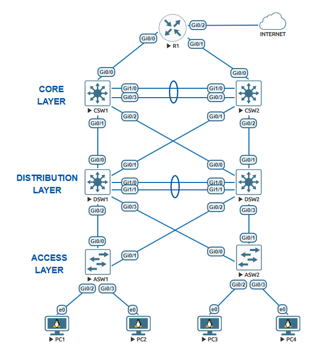

## Purpose

The purpose of this project is to design and implement a redundant three-tier enterprise campus network using EVE-NG. The network provides segmented user connectivity, dynamic routing, gateway redundancy, Internet access, centralized network services, and Layer 2 and Layer 3 security controls.

## Objectives

* Implement a three-tier enterprise campus network consisting of core, distribution, and access layers.
* Configure VLAN segmentation for USERS, GUEST, IT, and MANAGEMENT networks.
* Implement OSPF Area 0 for dynamic routing across the routed infrastructure.
* Implement HSRP to provide redundant default gateways for the VLANs.
* Implement LACP EtherChannel to provide link redundancy between network devices.
* Configure Rapid-PVST and distribute the STP root roles between the distribution switches.
* Configure centralized DHCP services on R1 and DHCP relay on the distribution switches.
* Implement NAT/PAT on R1 to provide Internet connectivity for the internal networks.
* Apply ACLs to control communication between internal VLANs.
* Implement Layer 2 security mechanisms including DHCP Snooping, Dynamic ARP Inspection, Port Security, PortFast, and BPDU Guard.
* Restrict administrative SSH access to the IT network.
* Verify network connectivity, routing, redundancy, network services, and security behavior within the EVE-NG environment.

## Network Topology

The laboratory implements a redundant three-tier enterprise campus network in EVE-NG. The topology consists of an edge router, two core switches, two distribution switches, and two access switches connecting four end devices.



### Topology Overview

The network is organized into the following layers:

| Layer        | Devices    | Primary Function                                                           |
| ------------ | ---------- | -------------------------------------------------------------------------- |
| Edge         | R1         | Internet connectivity, DHCP, NAT/PAT, and OSPF default-route advertisement |
| Core         | CSW1, CSW2 | Layer 3 routing and OSPF connectivity                                      |
| Distribution | DSW1, DSW2 | Inter-VLAN routing, HSRP, ACLs, OSPF, and STP control                      |
| Access       | ASW1, ASW2 | End-device connectivity, VLAN assignment, and Layer 2 security             |

The core layer provides redundant Layer 3 paths between the edge and distribution layers. The distribution layer provides the default gateways for the client VLANs and maintains redundancy through HSRP. The access layer connects end devices to the appropriate VLANs and applies Layer 2 security controls.

### Device Connections

The major connectivity relationships are:

* R1 connects to both CSW1 and CSW2 through routed Layer 3 links.
* CSW1 and CSW2 are interconnected through a Layer 3 LACP EtherChannel.
* CSW1 and CSW2 each have routed connections to DSW1 and DSW2.
* DSW1 and DSW2 are interconnected through a Layer 2 LACP EtherChannel configured as a trunk.
* DSW1 and DSW2 provide trunk connections toward the access switches.
* ASW1 and ASW2 provide access ports for the end devices.

This design provides multiple paths through the network and avoids dependence on a single core, distribution switch, or physical link.

### End-Device Connectivity

The access layer assigns end devices to different VLANs:

| Access Switch | Interface | VLAN | Network Role |
| ------------- | --------- | ---: | ------------ |
| ASW1          | Gi0/2     |   10 | USERS        |
| ASW1          | Gi0/3     |   20 | GUEST        |
| ASW2          | Gi0/2     |   10 | USERS        |
| ASW2          | Gi0/3     |   30 | IT           |

The access switches carry VLANs 10, 20, 30, and 99 through their trunk uplinks toward the distribution layer.

## IP Addressing Plan

The network uses separate address spaces for routed infrastructure links, device loopbacks and management, and end-user VLANs. Point-to-point infrastructure links use `/30` subnets, while loopback interfaces use `/32` addresses for stable device identification and OSPF router IDs.

### Infrastructure Addressing

| Device | Interface     | IP Address   | Subnet       | Connection / Purpose |
| ------ | ------------- | ------------ | ------------ | -------------------- |
| R1     | Gi0/0         | 10.0.1.1/30  | 10.0.1.0/30  | CSW1                 |
| CSW1   | Gi0/0         | 10.0.1.2/30  | 10.0.1.0/30  | R1                   |
| R1     | Gi0/1         | 10.0.1.5/30  | 10.0.1.4/30  | CSW2                 |
| CSW2   | Gi0/0         | 10.0.1.6/30  | 10.0.1.4/30  | R1                   |
| CSW1   | Port-channel1 | 10.0.1.9/30  | 10.0.1.8/30  | CSW2                 |
| CSW2   | Port-channel1 | 10.0.1.10/30 | 10.0.1.8/30  | CSW1                 |
| CSW1   | Gi0/1         | 10.0.1.13/30 | 10.0.1.12/30 | DSW1                 |
| DSW1   | Gi0/0         | 10.0.1.14/30 | 10.0.1.12/30 | CSW1                 |
| CSW2   | Gi0/1         | 10.0.1.17/30 | 10.0.1.16/30 | DSW1                 |
| DSW1   | Gi0/1         | 10.0.1.18/30 | 10.0.1.16/30 | CSW2                 |
| CSW1   | Gi0/2         | 10.0.1.21/30 | 10.0.1.20/30 | DSW2                 |
| DSW2   | Gi0/0         | 10.0.1.22/30 | 10.0.1.20/30 | CSW1                 |
| CSW2   | Gi0/2         | 10.0.1.25/30 | 10.0.1.24/30 | DSW2                 |
| DSW2   | Gi0/1         | 10.0.1.26/30 | 10.0.1.24/30 | CSW2                 |

The routed point-to-point interfaces use OSPF network type `point-to-point`.

### Loopback and Management Addressing

| Device | Interface | IP Address   | Purpose                            |
| ------ | --------- | ------------ | ---------------------------------- |
| R1     | Loopback0 | 10.0.2.1/32  | OSPF router ID / internal services |
| CSW1   | Loopback0 | 10.0.2.2/32  | OSPF router ID                     |
| CSW2   | Loopback0 | 10.0.2.3/32  | OSPF router ID                     |
| DSW1   | Loopback0 | 10.0.2.4/32  | OSPF router ID                     |
| DSW2   | Loopback0 | 10.0.2.5/32  | OSPF router ID                     |
| DSW1   | VLAN 99   | 10.0.2.18/28 | Management                         |
| DSW2   | VLAN 99   | 10.0.2.19/28 | Management                         |
| ASW1   | VLAN 99   | 10.0.2.21/28 | Management                         |
| ASW2   | VLAN 99   | 10.0.2.22/28 | Management                         |

The management VLAN uses the `10.0.2.16/28` subnet, with `10.0.2.17` configured as its HSRP virtual gateway.

### Client VLAN Addressing

| VLAN | Name       | Network      | HSRP Virtual Gateway |
| ---: | ---------- | ------------ | -------------------- |
|   10 | USERS      | 10.0.10.0/24 | 10.0.10.1            |
|   20 | GUEST      | 10.0.20.0/24 | 10.0.20.1            |
|   30 | IT         | 10.0.30.0/24 | 10.0.30.1            |
|   99 | MANAGEMENT | 10.0.2.16/28 | 10.0.2.17            |

The distribution switches use the following SVI addresses:

| VLAN | DSW1      | DSW2      | Virtual Gateway |
| ---: | --------- | --------- | --------------- |
|   10 | 10.0.10.2 | 10.0.10.3 | 10.0.10.1       |
|   20 | 10.0.20.2 | 10.0.20.3 | 10.0.20.1       |
|   30 | 10.0.30.2 | 10.0.30.3 | 10.0.30.1       |
|   99 | 10.0.2.18 | 10.0.2.19 | 10.0.2.17       |

End devices in VLANs 10, 20, and 30 obtain their addresses through DHCP services provided by R1. The distribution switches relay DHCP requests to R1 using `10.0.2.1` as the DHCP server address.

## VLAN and Network Segmentation

The network uses four VLANs to separate user, guest, IT, and management traffic.

| VLAN | Name       | Network      | Purpose                   |
| ---: | ---------- | ------------ | ------------------------- |
|   10 | USERS      | 10.0.10.0/24 | General users             |
|   20 | GUEST      | 10.0.20.0/24 | Guest devices             |
|   30 | IT         | 10.0.30.0/24 | IT administration         |
|   99 | MANAGEMENT | 10.0.2.16/28 | Network device management |

VLANs 10, 20, 30, and 99 are carried across the distribution and access layers using 802.1Q trunks, with VLAN 999 configured as the native VLAN.

The distribution switches provide Layer 3 interfaces for the VLANs, while HSRP provides the virtual default gateways.

The access switches assign end devices to their respective VLANs:

* **ASW1:** VLAN 10 and VLAN 20
* **ASW2:** VLAN 10 and VLAN 30

## Routing Design

The routed portion of the network uses **OSPF Area 0** to dynamically exchange routes between R1, CSW1, CSW2, DSW1, and DSW2.

Point-to-point links between the core and distribution layers use `/30` networks, while loopback interfaces provide stable OSPF router IDs.

| Device | OSPF Router ID |
| ------ | -------------- |
| R1     | 10.0.2.1       |
| CSW1   | 10.0.2.2       |
| CSW2   | 10.0.2.3       |
| DSW1   | 10.0.2.4       |
| DSW2   | 10.0.2.5       |

R1 also originates the default route into OSPF, allowing internal devices to reach the Internet through the edge router.

The distribution switches advertise their VLAN networks into OSPF while keeping the VLAN interfaces passive.
This provides dynamic routing and multiple paths between the edge, core, and distribution layers.

## Redundancy and High Availability

The network uses multiple redundancy mechanisms to reduce dependence on individual devices and links.

### HSRP

HSRP provides redundant default gateways for the client and management VLANs.

| VLAN | Virtual Gateway | Preferred Active Switch |
| ---: | --------------- | ----------------------- |
|   10 | 10.0.10.1       | DSW1                    |
|   20 | 10.0.20.1       | DSW2                    |
|   30 | 10.0.30.1       | DSW1                    |
|   99 | 10.0.2.17       | DSW2                    |

This distributes the active gateway roles between DSW1 and DSW2 while providing failover if a distribution switch becomes unavailable.

### EtherChannel

LACP EtherChannel is used to provide link redundancy and combine multiple physical links into a single logical connection.

* **CSW1 ↔ CSW2:** Layer 3 EtherChannel
* **DSW1 ↔ DSW2:** Layer 2 trunk EtherChannel

### Spanning Tree

Rapid-PVST is used to prevent Layer 2 loops. STP root roles are distributed between DSW1 and DSW2 to align Layer 2 forwarding with the HSRP gateway distribution.

* DSW1 is preferred STP root for VLANs 10 and 30.
* DSW2 is preferred STP root for VLANs 20 and 99.

## Network Security

The network implements multiple security controls across the Layer 2 and Layer 3 infrastructure.

### Layer 3 Security

Extended ACLs restrict communication between the USERS, GUEST, and internal infrastructure networks while allowing the required DHCP traffic.

### Layer 2 Security

The access switches implement:

* DHCP Snooping
* Dynamic ARP Inspection
* Port Security with sticky MAC addresses
* PortFast
* BPDU Guard

These controls are applied primarily to the access layer and host-facing ports.

### Management Security

SSH version 2 is enabled for device management, with access restricted to the IT network (`10.0.30.0/24`) through the `SSH-IT` access list.

## Network Services

The network provides centralized DHCP services and Internet connectivity through R1.

### DHCP

R1 operates as the DHCP server for the USERS, GUEST, and IT VLANs.

| VLAN | DHCP Network | Default Gateway |
| ---: | ------------ | --------------- |
|   10 | 10.0.10.0/24 | 10.0.10.1       |
|   20 | 10.0.20.0/24 | 10.0.20.1       |
|   30 | 10.0.30.0/24 | 10.0.30.1       |

### DHCP Relay

The distribution switches use DHCP relay to forward client requests to R1 at `10.0.2.1`.

### NAT/PAT

R1 performs NAT overload for the USERS, GUEST, and IT networks through its external interface, allowing internal clients to access external networks using the R1 WAN connection.

## Implementation

The network was implemented in EVE-NG following the topology and addressing plan described above.

The implementation was completed in the following stages:

1. **Topology Deployment** — Created the network topology and connected the devices according to the designed architecture.
2. **Base Configuration** — Configured hostnames, administrative access, and device management settings.
3. **Layer 3 Infrastructure** — Configured the routed point-to-point links and loopback interfaces.
4. **OSPF** — Established OSPF Area 0 between the routed devices.
5. **VLANs and Trunking** — Configured VLANs 10, 20, 30, and 99 and extended them across the required trunk links.
6. **EtherChannel** — Configured LACP EtherChannel links between the core and distribution switches.
7. **SVIs and HSRP** — Configured the VLAN interfaces and redundant default gateways on DSW1 and DSW2.
8. **STP** — Configured Rapid-PVST and assigned the preferred root switches for each VLAN.
9. **Network Services** — Configured DHCP, DHCP relay, and NAT/PAT.
10. **Security Controls** — Applied ACLs, DHCP Snooping, Dynamic ARP Inspection, Port Security, PortFast, BPDU Guard, and SSH access restrictions.
11. **End Devices** — Connected the end devices to their assigned access VLANs and obtained their network parameters through DHCP.

The complete device configurations are available in the [`configs/`](configs/) directory.

## Verification and Testing

The implemented network is verified through connectivity, routing, redundancy, network service, and security checks.

### Connectivity

Connectivity between end devices and their default gateways is tested using ICMP ping.

### Routing

OSPF operation and route propagation are verified using:

```text
show ip ospf neighbor
show ip route
```

### HSRP

Gateway redundancy is verified using:

```text
show standby
```

This confirms the active and standby HSRP roles for each VLAN.

### EtherChannel and STP

Link aggregation and Layer 2 topology are verified using:

```text
show etherchannel summary
show spanning-tree
```

### VLAN and Trunking

VLAN membership and trunk operation are verified using:

```text
show vlan brief
show interfaces trunk
```

### DHCP and NAT

DHCP address allocation is verified using:

```text
show ip dhcp binding
```

NAT operation is verified using:

```text
show ip nat translations
```

### Security

Layer 2 security mechanisms and access control are verified using:

```text
show ip dhcp snooping
show ip arp inspection
show port-security
```

ACL behavior is verified by testing both permitted and restricted traffic between the VLANs.

Screenshots and verification results can be added to the `screenshots/` directory as testing is documented.

## Configuration Files

The complete configurations for the network devices are provided in the [`configs/`](configs/) directory.

| Device | Role                | Configuration                  |
| ------ | ------------------- | ------------------------------ |
| R1     | Edge Router         | [`R1.txt`](configs/R1.txt)     |
| CSW1   | Core Switch         | [`CSW1.txt`](configs/CSW1.txt) |
| CSW2   | Core Switch         | [`CSW2.txt`](configs/CSW2.txt) |
| DSW1   | Distribution Switch | [`DSW1.txt`](configs/DSW1.txt) |
| DSW2   | Distribution Switch | [`DSW2.txt`](configs/DSW2.txt) |
| ASW1   | Access Switch       | [`ASW1.txt`](configs/ASW1.txt) |
| ASW2   | Access Switch       | [`ASW2.txt`](configs/ASW2.txt) |

These files contain the device configurations used to implement the network described in this documentation.

## Lessons Learned

This project provided practical experience in designing and implementing a redundant enterprise campus network in a virtualized environment.

Key concepts demonstrated include:

* Designing a hierarchical three-tier network architecture.
* Implementing dynamic routing with OSPF.
* Providing gateway redundancy using HSRP.
* Using EtherChannel and STP to improve Layer 2 availability and control.
* Segmenting network traffic using VLANs.
* Implementing centralized DHCP and NAT/PAT services.
* Applying ACLs to control inter-VLAN communication.
* Implementing Layer 2 security mechanisms to protect access ports and DHCP/ARP operations.
* Managing network devices securely through restricted SSH access.
* Verifying network behavior through routing, connectivity, redundancy, and security tests.

